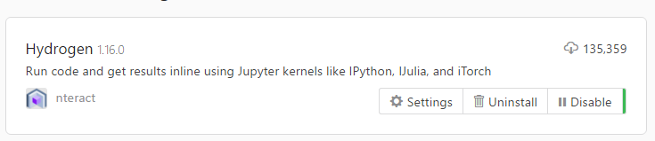
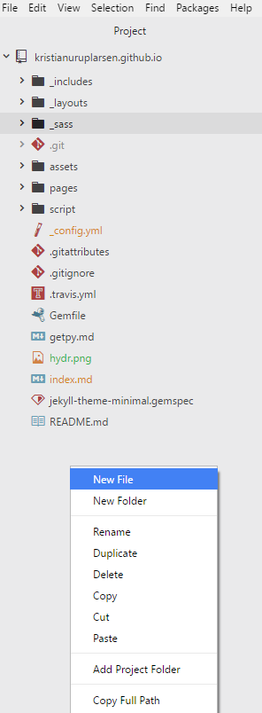

## 1)
Installer MiniConda med python 3.x fra deres [downloadside](https://conda.io/miniconda.html) - conda kan holde styr på din pythoninstallation, og skal bruges til at installere pakker. (Du vil gerne tilføje conda til din system-PATH, selvom de fraråder det)

## 2)
Installer Atom fra deres [hjemmeside](http://atom.io/)

### 2.1)
Atom skal bruge en python-pakke der hedder `jupyter` og en Atom pakke der hedder `Hydrogen` for at køre python kode, start med at installere jupyter ved at åbne command-prompten (kør: cmd) og skriv

```
pip3 install --upgrade pip
pip3 install jupyter
```

Åben derefter Atom og vælg file > settings > install og søg efter 'Hydrogen', det skulle gerne se således ud:


Det kan også anbefales at installere pakkerne `minimap` og `file-icons`, samt at ændre temaet fra mørkt til lyst.


## 3)
Nu burde python køre på din computer. Næste skridt er at åbne atom og lave en ny `.py` fil. Det nemmeste er at starte med at oprette en tom mappe på skrivebordet, og i atom trykke file > Open Folder for at åbne mappen. Højreklik på dete grå område under mappen for at oprette en ny fil med navnet `HelloWorld.py`.


